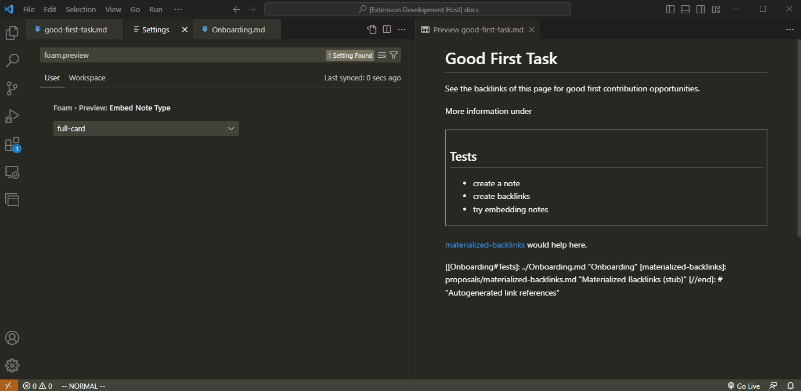

# Tipos Integrados de Incorporação de Notas

Ao incorporar uma nota, existem algumas maneiras de modificar o escopo do conteúdo e seu estilo de exibição. A seguir estão as palavras-chave do Foam que são usadas para descrever a incorporação de notas.

Note que isso se aplica apenas à incorporação de notas, não à incorporação de anexos ou imagens.

## Escopo

- `full` - a nota inteira no caso de `![[note]]` ou a seção inteira no caso de `![[note#section1]]`
- `content` - tudo excluindo o título da seção. Então a nota inteira menos o título para `![[note]]`, ou a seção inteira menos o cabeçalho da seção para `![[note#section1]]`

## Estilo

- `card` - contorna a nota incorporada com uma borda
- `inline` - adiciona a nota continuamente como se o texto fosse parte da nota chamadora

## Configuração Padrão

O Foam expressa o tipo de exibição da nota como `<escopo>-<estilo>`.

Por padrão, o Foam configura a incorporação de notas como `full-card`. Ou seja, sempre que a sintaxe de incorporação padrão é usada, `![[note]]`, a nota terá escopo `full` e exibição de estilo `card`. Esta configuração é armazenada em `foam.preview.embedNoteStyle` e pode ser modificada.

## Modificadores Explícitos

Adicione uma das palavras-chave de escopo ou estilo, ou uma combinação das duas, antes do wikilink para modificar explicitamente uma incorporação de nota se você quiser substituir a configuração padrão.

Por exemplo, dado que seu `foam.embedNoteStyle` está definido como `content-card`, incorporar uma nota com a sintaxe padrão `![[note-a]]` mostraria uma nota com borda sem seu título. Digamos que, para uma `note-b` específica, você gostaria de exibir o título. Você pode simplesmente usar uma das palavras-chave acima para substituir sua configuração padrão assim: `full![[note-b]]`. Neste caso, `full` substitui o escopo padrão `content` e, como um estilo não é especificado, ele volta para a configuração de estilo padrão, `card`. Se você quiser que seja inline, substitua isso também: `full-inline![[note-b]]`.
