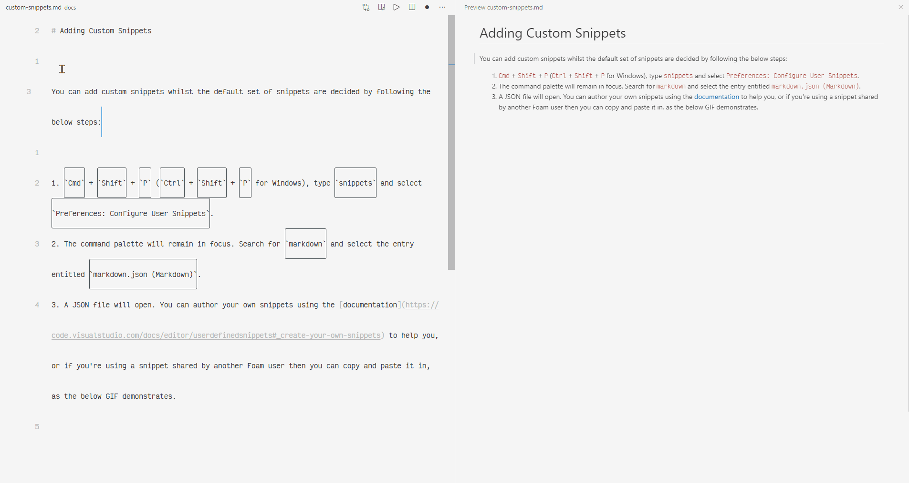

# Adicionando Snippets Personalizados

Você pode adicionar snippets personalizados enquanto o conjunto padrão de snippets é decidido seguindo os passos abaixo:

1. `Cmd` + `Shift` + `P` (`Ctrl` + `Shift` + `P` para Windows), digite `snippets` e selecione `Preferences: Configure User Snippets`.
2. A paleta de comandos permanecerá em foco. Procure por `markdown` e selecione a entrada intitulada `markdown.json (Markdown)`.
3. Um arquivo JSON será aberto. Você pode criar seus próprios snippets usando a [documentação](https://code.visualstudio.com/docs/editor/userdefinedsnippets#_create-your-own-snippets) para ajudá-lo, ou se você estiver usando um snippet compartilhado por outro usuário do Foam, você pode copiá-lo e colá-lo, como o GIF abaixo demonstra:
   

Para começar, você pode considerar substituir todo o conteúdo do arquivo `markdown.json` aberto pelos passos acima com o JSON neste [comentário](https://github.com/foambubble/foam/pull/192#issuecomment-666736270).
