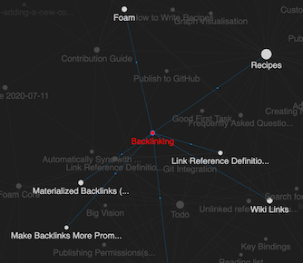

# Visualização do Grafo

O Foam vem com uma visualização em grafo das suas notas.
Para ver o grafo, execute o comando `Foam: Show Graph`.

Seus arquivos, como notas e documentos, são mostrados como os nós do grafo junto com as tags definidas em suas notas. As arestas do grafo representam ou um link entre dois arquivos ou um arquivo que contém uma determinada tag. Um nó no grafo crescerá em tamanho com o número de conexões que possui, representando conceitos e tópicos mais fortes ou mais definidos.

## Navegação no Grafo

Com a visualização do grafo do Foam você pode:

- destacar um nó passando o mouse sobre ele, para ver rapidamente como ele está conectado ao resto das suas notas
- selecionar um ou mais nós (mantendo `shift` pressionado durante a seleção) clicando neles, para entender melhor a estrutura das suas notas
- navegar para uma nota clicando em seu nó enquanto pressiona `ctrl` ou `cmd`
- centralizar automaticamente o grafo na nota atualmente editada, para ver imediatamente suas conexões

## Filtrar Visualização

Se você deseja visualizar apenas certos tipos de notas ou tags, ou quer ocultar nós de anexos vinculados, você pode aplicar filtros ao grafo.

- Abra a visualização do grafo usando o comando `Foam: Show Graph`
- Clique no botão no canto superior direito da visualização do grafo que diz "Open Controls"
- Expanda o menu suspenso "Filter By Type" para ver a seleção de tipos que você pode filtrar
- Desmarque a caixa de seleção para qualquer tipo que você queira ocultar
- Os tipos exibidos neste menu suspenso são definidos por [[note-properties]], que inclui tipos padrão do Foam e tipos personalizados definidos por você!


## Estilos Personalizados do Grafo

O grafo do Foam usará o tema atual do VS Code por padrão, mas é possível personalizá-lo com a configuração `foam.graph.style`.


Um exemplo de objeto de configuração é fornecido abaixo, você pode fornecer tanta ou tão pouca configuração quanto desejar:

```json
"foam.graph.style": {
    "background": "#202020",
    "fontSize": 12,
    "fontFamily": "Sans-Serif",
    "lineColor": "#277da1",
    "lineWidth": 0.2,
    "particleWidth": 1.0,
    "highlightedForeground": "#f9c74f",
    "node": {
        "note": "#277da1",
    }
}
```

- `background` cor de fundo do grafo, ajuste para aumentar o contraste
- `fontSize` tamanho da fonte do título para cada nó
- `fontFamily` fonte do título para cada nó
- `lineColor` cor das arestas entre os nós no grafo
- `lineWidth` espessura das arestas entre os nós
- `particleWidth` tamanho da animação de partículas mostrando a direção do link ao destacar um nó
- `highlightedForeground` cor dos nós e arestas destacados ao passar o mouse sobre um nó
- para estilizar tipos individuais de nós, pule para a próxima seção: [Estilizar Nós por Tipo](#style-nodes-by-type)

### Estilizar Nós por Tipo

É possível personalizar o estilo de um nó com base na propriedade `type` no frontmatter YAML do documento correspondente.

Existem alguns tipos de nós padrão definidos pelo Foam que são exibidos no grafo:

- `note` define a cor para nós regulares cujos documentos não sobrescreveram a propriedade `type`.
- `placeholder` define a cor para links que não correspondem a nenhuma nota existente. Este é um [[placeholder]] porque nenhum arquivo com esse nome existe.
  - veja [[wikilinks]] para mais informações <!--NOTE: this placeholder link should NOT have an associated file. This is to demonstrate the custom coloring-->
- `tag` define a cor para nós representando #tags, permitindo que tags sejam usadas como nós do grafo similar a backlinks.
  - veja [[tags]] para mais informações
- `feature` mostra um exemplo de como você pode usar tipos de notas para personalizar o grafo. Define a cor para as notas do tipo `feature`
  - veja [[note-properties]] para detalhes

Por exemplo, a seguinte nota `backlinking.md`:

```markdown
---
type: feature
---
# Backlinking

...
```

E o seguinte `settings.json`:

```json
"foam.graph.style": {
    "background": "#202020",
    "node": {
        "note": "#277da1",
        "placeholder": "#545454",
        "tag": "#f9c74f",
        "feature": "red",
    }
}
```

Resultará no seguinte grafo:



