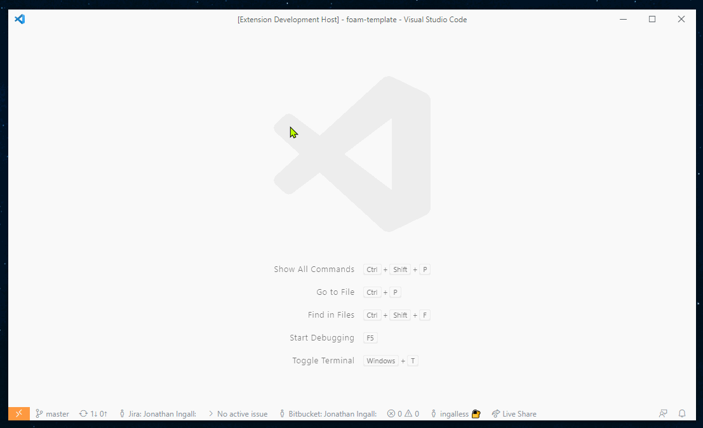
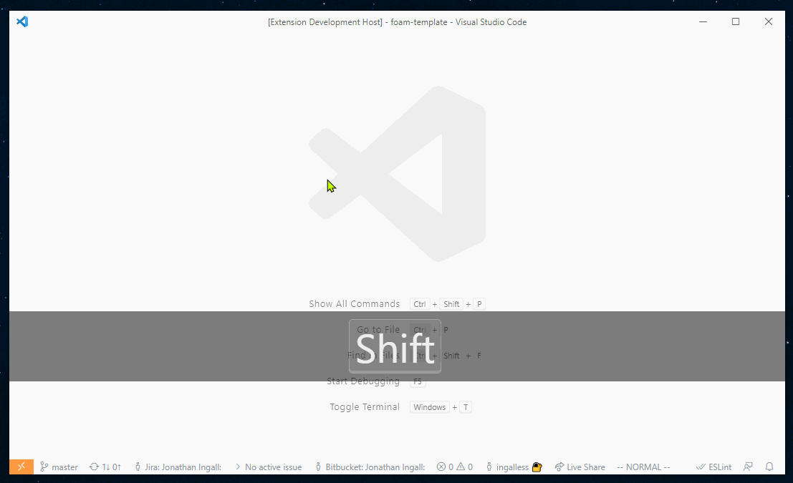
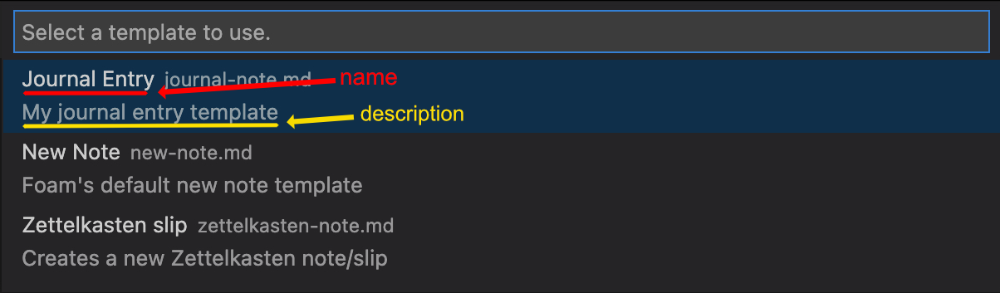

# Modelos de Notas

O Foam suporta modelos de notas que permitem que você personalize o conteúdo inicial de suas notas em vez de sempre começar com uma nota vazia.

Os modelos de notas são arquivos `.md` localizados no diretório especial `.foam/templates` do seu espaço de trabalho.

## Início Rápido

Crie um modelo:

- Execute o comando `Foam: Create New Template` na paleta de comandos
- OU crie manualmente um arquivo `.md` regular no diretório `.foam/templates`



_Tema: Ayu Light_

Para criar uma nota a partir de um modelo:

- Execute o comando `Foam: Create New Note From Template` e siga as instruções. Não se preocupe se você ainda não criou um modelo! Você será solicitado a criar um novo modelo se nenhum existir.
- OU execute o comando `Foam: Create New Note`, que usa o modelo padrão especial (`.foam/templates/new-note.md`, se existir)



_Tema: Ayu Light_

## Modelos Especiais

### Modelo Padrão

O modelo `.foam/templates/new-note.md` é especial porque é o modelo que será usado pelo comando `Foam: Create New Note`.
Personalize este modelo para conter o conteúdo que você deseja incluir sempre que criar uma nota. Para começar, é _recomendado_ definir o YAML Front-Matter do modelo similar ao seguinte:

```markdown
---
type: basic-note
---
```

### Modelo Padrão de Nota Diária

O modelo `.foam/templates/daily-note.md` é especial porque é o modelo que será usado ao criar notas diárias (por exemplo, usando `Foam: Open Daily Note`).
Personalize este modelo para conter o conteúdo que você deseja incluir sempre que criar uma nota diária. Para começar, é _recomendado_ definir o YAML Front-Matter do modelo similar ao seguinte:

```markdown
---
type: daily-note
---
```

## Variáveis

Os modelos podem usar todas as variáveis disponíveis em [Snippets do VS Code](https://code.visualstudio.com/docs/editor/userdefinedsnippets#_variables).

Além disso, você também pode usar variáveis fornecidas pelo Foam:

| Nome                 | Descrição                                                                                                                                                                                                                                   |
| -------------------- | ------------------------------------------------------------------------------------------------------------------------------------------------------------------------------------------------------------------------------------------- |
| `FOAM_SELECTED_TEXT` | O Foam preencherá com o texto selecionado ao criar uma nova nota, se algum texto estiver selecionado. O texto selecionado será substituído por um wikilink para a nova nota                                                                  |
| `FOAM_TITLE`         | O título da nota. Se usado, o Foam solicitará que você insira um título para a nota.                                                                                                                                                         |
| `FOAM_TITLE_SAFE`    | O título da nota em um formato seguro para o sistema de arquivos. Se usado, o Foam solicitará que você insira um título para a nota, a menos que `FOAM_TITLE` já tenha causado o prompt.                                                     |
| `FOAM_SLUG`          | O título da nota em formato slug (usando o método de slug padrão do github). Se usado, o Foam solicitará que você insira um título para a nota, a menos que `FOAM_TITLE` já tenha causado o prompt.                                          |
| `FOAM_DATE_*`        | `FOAM_DATE_YEAR`, `FOAM_DATE_MONTH`, `FOAM_DATE_WEEK` etc. Versões específicas do Foam das [variáveis de snippet de datetime do VS Code](https://code.visualstudio.com/docs/editor/userdefinedsnippets#_variables). Prefira estas versões às do VS Code. |

### Variáveis `FOAM_DATE_*`

O Foam define seu próprio conjunto de variáveis de datetime que têm um comportamento similar às [variáveis de snippet de datetime do VS Code](https://code.visualstudio.com/docs/editor/userdefinedsnippets#_variables).

Por exemplo, `FOAM_DATE_YEAR` tem o mesmo comportamento que o `CURRENT_YEAR` do VS Code, `FOAM_DATE_SECONDS_UNIX` tem o mesmo comportamento que `CURRENT_SECONDS_UNIX`, etc.

Por padrão, prefira usar as versões `FOAM_DATE_`. O datetime usado para calcular os valores será o mesmo para ambas as variáveis `FOAM_DATE_` e do VS Code, com exceção da criação de notas usando o modelo de nota diária.

Para mais detalhes técnicos sobre os formatos de data suportados, [veja aqui](https://github.com/foambubble/foam/blob/main/packages/foam-vscode/src/services/variable-resolver.ts).

#### Notas diárias relativas

Ao se referir a notas diárias, você pode usar os snippets relativos (`/+1d`, `/tomorrow`, etc.). Nesses casos, as novas notas serão criadas com o modelo de nota diária, mas o datetime usado deve ser o datetime relativo, não o datetime atual.
Ao usar as versões `FOAM_DATE_` das variáveis, a data relativa correta preencherá as variáveis, em vez do datetime atual.

Por exemplo, dado este modelo de nota diária (`.foam/templates/daily-note.md`):

```markdown
# $FOAM_DATE_YEAR-$FOAM_DATE_MONTH-$FOAM_DATE_DATE

## Aqui está o que vou fazer hoje

- Coisa 1
- Coisa 2
```

Quando o snippet `/tomorrow` é usado, as variáveis `FOAM_DATE_` serão preenchidas com a data de amanhã, como esperado.
Se em vez disso você usasse as versões do VS Code dessas variáveis, elas seriam preenchidas com a data de hoje, não a de amanhã, causando um comportamento inesperado.

Ao criar notas em qualquer outro cenário, os valores `FOAM_DATE_` são calculados usando o mesmo datetime que os do VS Code, então as versões `FOAM_DATE_` podem ser usadas em todos os cenários por padrão.

## Metadados

Os modelos também podem conter metadados sobre os próprios modelos. Os metadados são definidos em blocos YAML "Frontmatter" dentro dos modelos.

| Nome          | Descrição                                                                                                                         |
| ------------- | --------------------------------------------------------------------------------------------------------------------------------- |
| `filepath`    | O caminho do arquivo a ser usado ao criar a nova nota. Se o caminho for relativo, ele é relativo ao espaço de trabalho atual.     |
| `name`        | Um nome legível por humanos para mostrar no seletor de modelos.                                                                    |
| `description` | Uma descrição legível por humanos para mostrar no seletor de modelos.                                                              |

Variáveis específicas do Foam (por exemplo, `$FOAM_TITLE`) podem ser usadas dentro dos metadados do modelo. No entanto, as variáveis de snippet do VS Code ([atualmente](https://github.com/foambubble/foam/pull/655)) não são suportadas.

### Atributo `filepath`

O atributo de metadados `filepath` permite que você defina um caminho de arquivo relativo ou absoluto a ser usado ao criar uma nota usando o modelo. Se o caminho do arquivo for relativo, ele é relativo ao espaço de trabalho atual.

#### Exemplo de `filepath` **relativo**

Por exemplo, `filepath` pode ser usado para personalizar `.foam/templates/new-note.md`, substituindo o comportamento padrão do `Foam: Create New Note` de abrir o arquivo no mesmo diretório que o arquivo ativo:

```yaml
---
# Isso criará a nota no subdiretório "journal" do espaço de trabalho atual,
# independentemente de qual arquivo está ativo.
foam_template:
  filepath: 'journal/$FOAM_TITLE.md'
---
```

#### Exemplo de `filepath` **absoluto**

`filepath` pode ser um caminho absoluto, para que as notas sejam criadas no mesmo local, independentemente de qual arquivo ou espaço de trabalho o editor tem aberto atualmente.
O formato de um caminho absoluto pode variar dependendo do sistema de arquivos usado.

```yaml
---
foam_template:
  # Sistemas Unix / MacOS
  filepath: '/Users/john.smith/foam/journal/$FOAM_TITLE.md'

  # Sistemas Windows
  filepath: 'C:\Users\john.smith\Documents\foam\journal\$FOAM_TITLE.md'
---
```

#### Exemplo de `filepath` **baseado em data**

É possível variar o valor do `filepath` com base na data atual usando as variáveis `FOAM_DATE_*`. Isso é especialmente útil para o modelo de [[daily-notes]] se você deseja organizar por anos, meses, etc. Abaixo está um exemplo de uma seção de metadados do modelo de nota diária que criará novas notas diárias sob o caminho `journal/ANO/MES-NOME_MES/`. Por exemplo, quando uma nota é criada em 15 de novembro de 2022, um novo arquivo será criado em `C:\Users\foam_user\foam_notes\journal\2022\11-Nov\2022-11-15-daily-note.md`. Este método também respeita a criação de notas diárias relativas à data atual (ou seja, `/+1d`).

```markdown
---
type: daily-note
foam_template:
  description: Nota Diária para $FOAM_TITLE
  filepath: "C:\\Users\\foam_user\\foam_notes\\journal\\$FOAM_DATE_YEAR\\$FOAM_DATE_MONTH-$FOAM_DATE_MONTH_NAME_SHORT\\$FOAM_DATE_YEAR-$FOAM_DATE_MONTH-$FOAM_DATE_DATE-daily-note.md"
---

# Notas Diárias de $FOAM_DATE_YEAR-$FOAM_DATE_MONTH-$FOAM_DATE_DATE
```

> Nota: este método **requer** o uso de caminhos absolutos e, neste exemplo, está usando convenções de caminho do Windows. Este método também substituirá qualquer formatação de nome de arquivo definida em `.vscode/settings.json`

### Atributos `name` e `description`

Estes atributos fornecem um nome e uma descrição legíveis por humanos para serem mostrados no seletor de modelos (por exemplo, quando um usuário usa o comando `Foam: Create New Note From Template`):



### Adicionando metadados do modelo a um bloco YAML Frontmatter existente

Se seu modelo já tem um bloco YAML Frontmatter, você pode adicionar os metadados do modelo a ele.

#### Limitações

O Foam só suporta adicionar os metadados do modelo a blocos Frontmatter _YAML_. Se o bloco Frontmatter existente usa algum outro formato (por exemplo, JSON), você terá que adicionar os metadados do modelo em seu próprio bloco YAML Frontmatter.

Além disso, os metadados do modelo devem ser fornecidos como um [mapeamento de bloco YAML](https://yaml.org/spec/1.2/spec.html#id2798057), com os atributos colocados nas linhas imediatamente após a linha `foam_template`:

```yaml
---
existing_frontmatter: "Bloco Frontmatter existente"
foam_template: # isto é um mapeamento de "Bloco" YAML (mapeamentos de "Fluxo" não são suportados)
  name: Meu Modelo de Nota # Os atributos devem estar nas linhas imediatamente após `foam_template`
  description: Este é meu modelo de nota
  filepath: `journal/$FOAM_TITLE.md`
---
Este é o resto do modelo
```

Devido às limitações técnicas de análise do formato YAML complexo, a menos que os metadados sejam fornecidos nesta forma específica, o Foam não consegue remover corretamente os metadados do modelo antes de criar a nota resultante.

Se esta limitação se mostrar inconveniente para você, por favor nos avise. Podemos estender nossas capacidades de análise para cobrir seu caso de uso. Enquanto isso, você pode adicionar os metadados do modelo sem esta limitação fornecendo-os em seu próprio bloco YAML Frontmatter.

### Adicionando metadados do modelo em seu próprio bloco YAML Frontmatter

Você pode adicionar os metadados do modelo em seu próprio bloco YAML Frontmatter no início do modelo:

```yaml
---
foam_template:
  name: Meu Modelo de Nota
  description: Este é meu modelo de nota
  filepath: 'journal/$FOAM_TITLE.md'
---
Este é o resto do modelo
```

Se a nota já tem um bloco Frontmatter, um bloco Frontmatter específico do Foam pode ser adicionado ao início do modelo. O bloco Frontmatter específico do Foam deve sempre ser colocado no início do arquivo, e apenas espaços em branco podem separar os dois blocos Frontmatter.

```yaml
---
foam_template:
  name: Meu Modelo de Nota
  description: Este é meu modelo de nota
  filepath: 'journal/$FOAM_TITLE.md'
---

---
existing_frontmatter: 'Bloco Frontmatter existente'
---
Este é o resto do modelo
```

