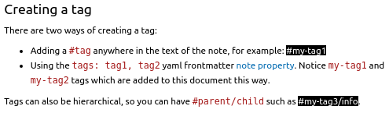

# Tags

Você pode adicionar tags às suas notas para categorizar ou conectar notas entre si.

## Criando uma tag

Existem duas maneiras de criar uma tag:

- Adicionando uma `#tag` em qualquer lugar no texto da nota, por exemplo: #my-tag1
- Usando a propriedade yaml frontmatter `tags: tag1, tag2` [[note-properties|propriedade da nota]]. Observe as tags `my-tag1` e `my-tag2` que foram adicionadas a este documento desta maneira.

As tags também podem ser hierárquicas, então você pode ter `#pai/filho` como #my-tag3/info.

### Autocompletar de tags

Digitar o caractere `#` iniciará o "Intellisense" do VS Code. Este provedor mostrará uma lista de possíveis tags que correspondem ao caractere. Se você estiver editando na [[note-properties|propriedade da nota]] frontmatter, você pode invocar o autocompletar de tags na linha `tags:` digitando o caractere `#` ou usando o atalho ["trigger suggest"](https://code.visualstudio.com/docs/editor/intellisense) (geralmente `ctrl+space`). Se o `#` for usado no frontmatter, ele será removido quando a tag for inserida.

## Usando o *Tag Explorer*

É possível navegar pelas tags através do painel Tag Explorer. Expanda a visualização do Tag Explorer na barra lateral esquerda, que listará todas as tags encontradas no ambiente Foam atual. Em seguida, cada nível de tags pode ser expandido até que sejam mostradas as opções para pesquisar por tag e uma lista de todos os arquivos contendo uma tag específica.

As tags também podem ser visualizadas no Foam Graph Explorer. Veja [[graph-visualization]] para mais informações, incluindo como mudar a cor dos nós que representam tags.

## Estilizando tags

É possível personalizar a aparência das tags no painel de Visualização Markdown que renderiza suas notas Foam. Isso requer algum conhecimento da linguagem CSS, que é usada para personalizar os estilos de tecnologias web como o VSCode. Uma introdução básica ao CSS pode ser [encontrada aqui](https://www.freecodecamp.org/news/get-started-with-css-in-5-minutes-e0804813fc3e/).

1. Crie um arquivo CSS dentro do seu projeto Foam, por exemplo em `.foam/css/custom-tag-style.css` ou [.vscode/custom-tag-style.css](../../.vscode/custom-tag-style.css)
2. Adicione código CSS que direcione a classe `.foam-tag`
3. Adicione uma regra para cada [propriedade CSS](https://www.w3schools.com/cssref/index.php) que você gostaria de aplicar às suas tags.
4. Abra o arquivo `.vscode/settings.json` (ou o navegador de Configurações com `ctrl+,`)
5. Adicione o caminho para sua nova folha de estilos na configuração `markdown.styles`.

> Nota: o caminho do arquivo para a folha de estilos será relativo à pasta atualmente aberta no espaço de trabalho ao alterar esta configuração para o espaço de trabalho atual. Se estiver alterando esta configuração para o usuário, então o caminho do arquivo será relativo às suas [configurações globais do VSCode](https://code.visualstudio.com/docs/getstarted/settings).

O resultado final será um arquivo CSS que se parece com o conteúdo abaixo. Agora você pode fazer suas tags se destacarem nas visualizações de suas notas.

```css
.foam-tag{
  color:#ffffff;
  background-color: #000000;
}
```



## Usando backlinks no lugar de tags

Dado o poder dos backlinks, algumas pessoas preferem usá-los como tags.
Por exemplo, você pode marcar suas notas sobre livros com [[book]].

[note-properties|propriedade da nota]: note-properties.md "Propriedades da Nota"
[graph-visualization]: graph-visualization.md "Visualização do Grafo"

